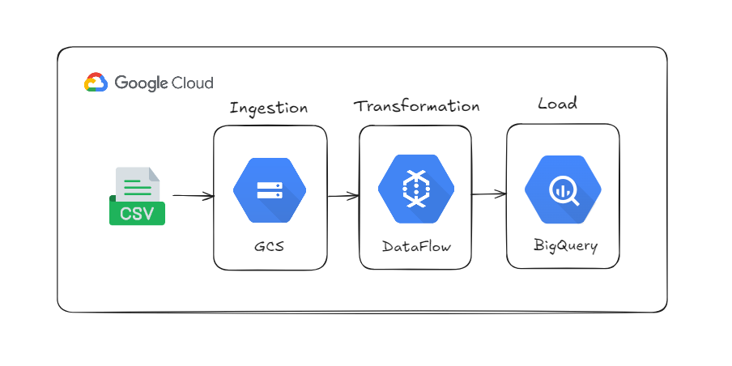
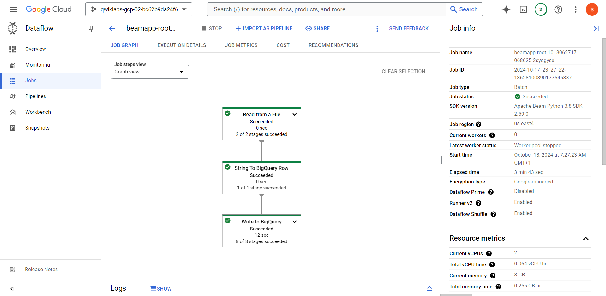
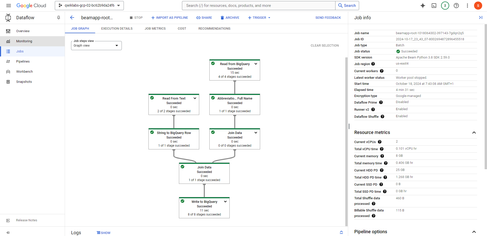

# 🚀 ETL Pipeline on Google Cloud platforme (GCP)

## 🌟 Overview

This project demonstrates how to build an ETL (Extract, Transform, Load) pipeline using Google Cloud services. We will utilize Dataflow (powered by Apache Beam) to process data and load it into BigQuery for analysis. Through a series of Python-based pipelines, we will explore data ingestion, transformation, enrichment, and data merging.

## 📒 Objectives

Ingest Data from Google Cloud Storage to BigQuery using Dataflow.
Transform Data into BigQuery-friendly formats.
Enrich Data to make it more meaningful.
Join Datasets and create a final table in BigQuery.
Explore Google Cloud services: Dataflow, BigQuery, and Cloud Storage

## 🛠️ Technologies 

- Google Cloud Platforme :

     Cloud Storage

     DataFlow ( apache beam )

     BigQuery 

- Python

## 🪄 Data Pipeline Stages

###  Data Ingestion, Transformation, and Load :

This stage covers the entire process from ingesting raw data from Cloud Storage,    transforming it into the necessary format, and loading it into BigQuery.

### Data Enrichment and Joining

The data is enriched by joining two tables to generate more valuable insights. Final results are stored in a well-structured BigQuery table for further analysis.

## 📝 Project Inspiration
This project is inspired by the Qwiklabs tutorial: ETL Processing on Google Cloud Using Dataflow and BigQuery (Python).

